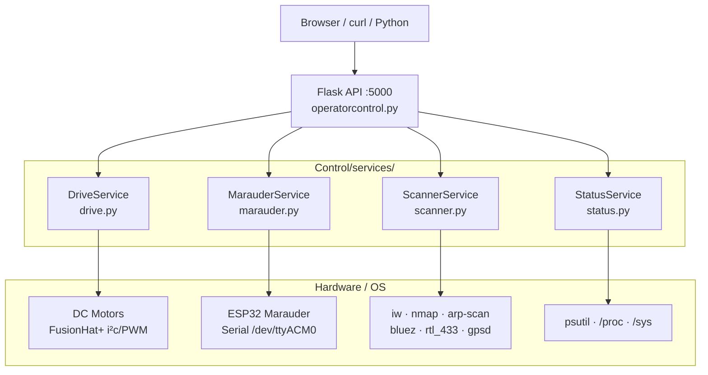

# Tengu Marauder Stryker

A mobile cyber-physical platform combining robot drive control, live camera, ESP32 Marauder integration, and passive wireless recon tools — packaged as a single Docker container designed for workshop demos, CTF events, and security research.

<p align="center">
  
</p>

> Hardware info and assembly guide: [hackaday.io/project/197212](https://hackaday.io/project/197212-tengu-maraduer)

---

## Quick Start (Docker — recommended)

### 1. Install Docker on the Pi

```bash
# Official Docker install script — handles arm64/armhf automatically
curl -fsSL https://get.docker.com -o get-docker.sh
sudo sh get-docker.sh

# Add your user to the docker group (avoids sudo on every command)
sudo usermod -aG docker $USER
newgrp docker

# Enable Docker on boot
sudo systemctl enable docker

# Verify — both should return version strings
docker --version
docker compose version
```

> Docker Compose v2 is included with the modern Docker install as `docker compose` (space, no hyphen). Do not install the old `docker-compose` package from apt.

### 2. Set up host permissions (run once)

The container runs as a non-root user. Hardware access (motors, GPIO, camera, serial) requires your Pi user to be in the correct OS groups. Run the setup script once to configure groups, udev rules, and generate the `.env` file automatically:

```bash
git clone https://github.com/ExMachinaParlor/Tengu-Marauder-Stryker.git
cd Tengu-Marauder-Stryker
sudo bash Install/install_host_permissions.sh
```

Then **log out and back in** (or reboot) for group membership to take effect. This is required — group changes don't apply to your current shell session.

### 3. Build and run

```bash
chmod +x tms-start.sh
./tms-start.sh
```

Open `http://<pi-ip>:5000` in a browser on the same network.

Find your Pi's IP with: `hostname -I`

#### Why `tms-start.sh` instead of `docker compose up`?

Docker refuses to start if any device listed in `compose.yaml` doesn't exist on the host (e.g. camera not plugged in, ESP32 not connected). `tms-start.sh` detects which devices are actually present and only maps those, so the container starts cleanly regardless of what hardware is connected at that moment. If a device disappears between detection and Docker startup (race condition), the script automatically retries without it.

```bash
./tms-start.sh            # start (detached)
./tms-start.sh --logs     # start and follow logs
./tms-start.sh --stop     # stop the container
./tms-start.sh --rebuild  # rebuild image then start
```

### Optional: Bluetooth hardware

If your Pi has Bluetooth and `/dev/hci0` exists, uncomment this line in `compose.yaml`:

```yaml
# - "/dev/hci0:/dev/hci0"
```

---

## Ubuntu 24.04 on Raspberry Pi 5 (USB boot)

This section covers everything needed to go from a blank USB drive to a running TMS instance on a Raspberry Pi 5 running Ubuntu 24.04 Server. Follow steps in order — each one is a hard dependency for the next.

### 1. Flash and boot Ubuntu 24.04 Server

Use [Raspberry Pi Imager](https://www.raspberrypi.com/software/) and select:

- **OS:** Other general-purpose OS → Ubuntu → Ubuntu Server 24.04 LTS (64-bit)
- **Storage:** your USB drive (SSD recommended — flash drives will be slow)

In the imager's advanced settings (gear icon), configure your hostname, SSH key, username, and WiFi credentials before writing. This avoids needing a monitor for first boot.

Boot the Pi 5 with the USB drive connected. SSH in once it's up:

```bash
ssh ubuntu@<pi-ip>
```

> Find the IP from your router's DHCP table, or connect a monitor and run `hostname -I`.

### 2. Enable I2C

Ubuntu does not enable I2C by default. The FusionHat+ motor controller requires it.

```bash
sudo nano /boot/firmware/config.txt
```

Add this line at the bottom:

```
dtparam=i2c_arm=on
```

Save and reboot:

```bash
sudo reboot
```

After reboot, verify the bus is up:

```bash
ls /dev/i2c-*
# Expected: /dev/i2c-1
```

### 3. Install the FusionHat+ kernel driver

The `fusion_hat` Python library communicates with the HAT through a kernel module that must be compiled against your running kernel. This is a one-time step.

```bash
# Install kernel headers for your exact running kernel
sudo apt update
sudo apt install -y git python3-pip linux-headers-$(uname -r)

# Clone and install the FusionHat+ library (driver + Python package)
git clone https://github.com/ExMachinaParlor/fusion-hat.git
cd fusion-hat
sudo python3 install.py
cd ..
```

Verify the driver loaded:

```bash
ls /sys/class/fusion_hat/
# Expected: fusion_hat/
```

If `linux-headers-$(uname -r)` returns "not found", try `sudo apt install linux-raspi-headers-*` or run `sudo apt upgrade` to sync your kernel to the latest available headers package, then reboot and retry.

### 4. Release WiFi interfaces from NetworkManager

Ubuntu uses NetworkManager by default. It will claim WiFi adapters and block `iw scan`, `arp-scan`, and monitor mode. Tell NM to leave your wireless interface alone:

```bash
# Check your interface name (commonly wlan0 or wlp2s0)
ip link show

# Release it from NetworkManager
sudo nmcli device set wlan0 managed no
```

To make this permanent across reboots, create `/etc/NetworkManager/conf.d/tms-unmanaged.conf`:

```bash
sudo tee /etc/NetworkManager/conf.d/tms-unmanaged.conf << 'EOF'
[keyfile]
unmanaged-devices=interface-name:wlan0
EOF
sudo systemctl reload NetworkManager
```

Replace `wlan0` with your actual interface name if different.

### 5. Install Docker

```bash
curl -fsSL https://get.docker.com -o get-docker.sh
sudo sh get-docker.sh

sudo usermod -aG docker $USER
newgrp docker

sudo systemctl enable docker
```

### 6. Clone the repo and configure host permissions

```bash
git clone https://github.com/ExMachinaParlor/Tengu-Marauder-Stryker.git
cd Tengu-Marauder-Stryker

# Creates hardware groups, udev rules, and generates .env with correct GIDs
sudo bash Install/install_host_permissions.sh
```

Log out and back in (or reboot) for group membership to take effect:

```bash
sudo reboot
```

### 7. Build and run

```bash
cd Tengu-Marauder-Stryker
chmod +x tms-start.sh
./tms-start.sh --rebuild
```

Open `http://<pi-ip>:5000` in a browser on the same network.

### 8. Run the test suite (optional but recommended)

Before trusting live hardware, verify the services are wired correctly:

```bash
python3 Tests/run_tests.py -v
```

All tests run without hardware present. A passing suite confirms motor port assignments, command whitelist, API routing, and watchdog timing are correct before you put the robot on the floor.

### Troubleshooting

| Symptom | Likely cause | Fix |
|---|---|---|
| `/dev/i2c-1` missing | I2C not enabled | Add `dtparam=i2c_arm=on` to `/boot/firmware/config.txt` and reboot |
| Motors don't move, drive shows "offline" | FusionHat+ driver not loaded | Re-run `sudo python3 fusion-hat/install.py` after installing `linux-headers-$(uname -r)` |
| `iw scan` fails or returns no networks | NetworkManager holding interface | `sudo nmcli device set wlan0 managed no` |
| Container fails to start | Missing `.env` or wrong GIDs | Re-run `sudo bash Install/install_host_permissions.sh` |
| `rtl-433` not found during Docker build | universe repo not enabled | The Dockerfile now handles this — rebuild with `./tms-start.sh --rebuild` |
| SSH times out on first boot | Pi still booting from USB, or wrong IP | Wait 60–90 s; check router DHCP table for the Pi's IP |
| `fusion_hat` sysfs path missing after reboot | Kernel module not set to auto-load | Run `sudo python3 fusion-hat/install.py` again — it adds the module to `/etc/modules` |

---

## Operator Console

The web UI exposes four panels:

| Panel | What it does |
|---|---|
| **Camera Feed** | Live MJPEG stream from USB camera |
| **Drive Control** | Forward / back / left / right / stop with 3s watchdog |
| **Wireless Ops** | Send whitelisted commands to ESP32 Marauder over serial |
| **System Status** | CPU, RAM, disk, uptime, GPS, module health |
| **Recon** | Wireless interfaces, LAN host scan, Bluetooth scan, RTL-SDR RF scan |

---

## REST API

All endpoints return JSON. Motor control no longer requires a browser.

```bash
# Drive
curl -X POST http://pi:5000/api/move -H 'Content-Type: application/json' -d '{"direction":"forward"}'
curl -X POST http://pi:5000/api/stop

# Marauder
curl -X POST http://pi:5000/api/marauder -H 'Content-Type: application/json' -d '{"command":"scanap"}'
curl http://pi:5000/api/marauder/logs

# Status
curl http://pi:5000/api/status

# Recon
curl http://pi:5000/api/wireless/interfaces
curl -X POST http://pi:5000/api/scan/network   # start async scan
curl http://pi:5000/api/scan/network           # poll results
curl -X POST http://pi:5000/api/scan/bluetooth
curl http://pi:5000/api/scan/bluetooth
curl -X POST http://pi:5000/api/scan/rf        # requires RTL-SDR dongle
curl http://pi:5000/api/scan/rf
```

### `/api/status` response

```json
{
  "cpu_percent": 18.2,
  "ram_used_mb": 412,
  "ram_total_mb": 3900,
  "ram_percent": 10.6,
  "disk_used_gb": 8.1,
  "disk_total_gb": 29.5,
  "uptime": "00:42:11",
  "motors": "online",
  "marauder": "connected",
  "gps": "40.71280, -74.00600"
}
```

---

## Architecture



Hardware is only accessed through service modules in `Control/services/`. The Flask layer contains only routes.

---

## Project Structure

```
Tengu-Marauder-Stryker/
├── Control/
│   ├── operatorcontrol.py      Flask entry point — routes only
│   ├── hardware/
│   │   └── robot_hat_bridge.py FusionHat+ import with graceful fallback
│   ├── services/
│   │   ├── drive.py            Motor control + 3s watchdog
│   │   ├── marauder.py         ESP32 serial + command whitelist
│   │   ├── scanner.py          Passive recon (iw, nmap, BT, RF, GPS)
│   │   └── status.py           System telemetry (psutil)
│   ├── utils/
│   │   └── ringbuffer.py       Thread-safe log ring buffer
│   ├── templates/
│   │   └── index.html          Operator console UI
│   └── static/
│       └── app.js              Fetch-based JS (no framework)
├── Install/
│   ├── robot_hat_install.sh        FusionHat+ library
│   ├── install_passive_recon.sh    Kismet, nmap, tshark, gpsd, bluez…
│   ├── install_active_wireless.sh  Aircrack-ng, hcxdumptool, Bettercap…
│   └── install_device_integrations.sh  esptool, PlatformIO, Flipper udev
├── Tests/                      unittest suite (drive, marauder, scanner, status, API)
├── VPN/                        WireGuard + hidden AP setup
├── Dockerfile                  Multi-stage, non-root, hardened
├── compose.yaml                NET_ADMIN/NET_RAW, no privileged mode
└── requirements.txt            Pinned Python dependencies
```

---

## Install Scripts (SD Card / Host OS)

Run these on the Raspberry Pi host OS, not inside Docker.

```bash
# 1. Safe passive recon tools (Kismet, wavemon, tshark, nmap, gpsd, bluez, rtl_433…)
sudo bash Install/install_passive_recon.sh

# 2. Active wireless testing tools — authorized use only
sudo bash Install/install_active_wireless.sh

# 3. Device integration support (esptool, PlatformIO, Flipper udev, HackRF)
sudo bash Install/install_device_integrations.sh
```

Script 2 installs: Aircrack-ng suite, hcxdumptool/hcxtools, Reaver/Pixiewps, mdk4, Bettercap, Wifite2, hostapd/dnsmasq.

> Active tools are for **authorized penetration testing only**. Obtain written authorization before testing any network you do not own.

---

## Manual Setup (no Docker)

```bash
git clone https://github.com/ExMachinaParlor/fusion-hat.git
cd fusion-hat && sudo python3 install.py
cd ..

python3 -m venv venv
source venv/bin/activate
pip install -r requirements.txt

python3 Control/operatorcontrol.py
```

---

## Bill of Materials

| Component | Purpose | Suggested Part |
|---|---|---|
| **Raspberry Pi 5 (4–8 GB)** | Host controller — Flask, Docker, recon tools | [raspberrypi.com](https://www.raspberrypi.com/products/raspberry-pi-5/) |
| **USB SSD (64–256 GB)** | OS + software storage — faster than SD for sustained Docker I/O | USB 3.0 SSD in a USB-A enclosure |
| **ESP32 Dev Board** | Wi-Fi scanning via Marauder firmware | [ESP32 WROOM DevKit](https://www.amazon.com/ESP32-DevKitC-V4-WROOM-32D-Bluetooth/dp/B08D5ZD528) |
| **ESP32 Marauder Firmware** | Offensive Wi-Fi toolkit for ESP32 | [github.com/justcallmekoko/ESP32Marauder](https://github.com/justcallmekoko/ESP32Marauder) |
| **USB Camera (UVC)** | Live camera feed | [Logitech C270](https://www.amazon.com/Logitech-Widescreen-Calling-Recording-Desktop/dp/B004FHO5Y6) |
| **FusionHat+ (SunFounder)** | Motor PWM + I²C control | [github.com/ExMachinaParlor/fusion-hat](https://github.com/ExMachinaParlor/fusion-hat) |
| **DC Motors + Wheels** | Drive system | [TT Motors Kit](https://www.amazon.com/HiLetgo-65mm-Plastic-Smart-Robot/dp/B00HJ6ACY2) |
| **Chassis** | Mount for all components | [Printables model](https://www.printables.com/model/1395179-tengu-marauder-vanguard) |
| **LiPo Battery (7.4V 2S)** | Mobile power | [Zeee 7.4V 2S](https://www.amazon.com/Zeee-Battery-Airplane-Helicopter-Quadcopter/dp/B07CZZZ3J9) |
| **5V Buck Converter** | Stable 5V for Pi | [DROK Buck Converter](https://www.amazon.com/DROK-Converter-Voltage-Regulator-Transformer/dp/B00C0KL1OM) |
| **USB Serial Cable** | ESP32 programming + power | [Micro-USB Data Cable](https://www.amazon.com/Amazon-Basics-Male-Micro-Cable/dp/B0719PHMTF) |
| **Optional: HackRF One** | RF analysis + SDR | [greatscottgadgets.com](https://greatscottgadgets.com/hackrf/) |
| **Optional: RTL-SDR Dongle** | IoT RF decoding (rtl_433) | RTL2832U-based USB dongle |
| **Optional: RNode** | Reticulum mesh networking | [unsigned.io/rnode](https://unsigned.io/rnode/) |

---

## Docker Management

```bash
# Rebuild after code changes
docker compose build && docker compose up -d

# View logs
docker compose logs -f

# Shell into running container
docker compose exec tms bash

# Remove container and image
docker compose down
docker rmi exmachinaparlor/tengu-marauder-stryker:local
```
